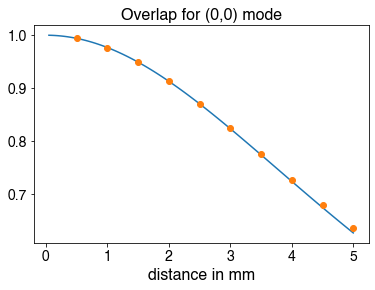

FFT-based simulation of beam propagation
=================================  
Musawwadah Mukhtar, PhD  
https://github.com/DrMukhtar  

# Practical information
This repository... ...To the script in terminal
`
python3 BeamPropagation.py input.csv
`

...parameters:
* fixed simulation parameters: number of points grid ($N$) and size of the gride ($L$) in one dimension;
* input beam parameters:...
* ...

# Numerical method

# Conclusion

# References

